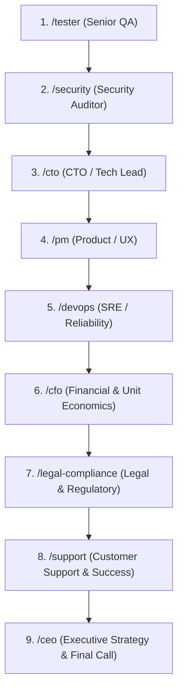

# Product Review Pipeline (`/pipeline-review`)

This skill orchestrates the end-to-end multi-agent Product Review Pipeline across all specialized roles.

## Review Stages & Execution Sequence

When reviewing a significant change, feature, or release, run the roles in this verified order so each subsequent role builds upon the findings of prior reviewers:

## Recommended Pipeline Subsets

1. **Lightweight / Rapid Review (Small PRs / Internal Tweaks)**:
   - `/tester` → `/cto` → `/ceo`
2. **Security & Cryptography Changes (Key Vaults, Auth, Secrets)**:
   - `/tester` → `/security` → `/cto` → `/devops` → `/ceo`
3. **Public Launch / Monetization / Customer-Facing**:
   - Full 9-stage pipeline (`/tester` through `/ceo`)

## Execution Principle: Layered Intelligence
When executing any role in the pipeline:
1. Always inspect and cite relevant findings from the earlier stages (e.g. CTO evaluates architectural debt surfaced by QA bugs; CFO sizes financial liability from Security flaws; CEO synthesizes all reports for the final go/no-go call).
2. Format each stage output using that role's exact, standardized Markdown Report Format.
